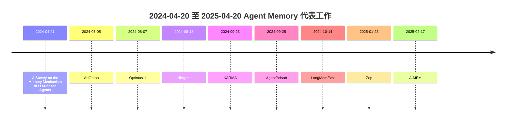
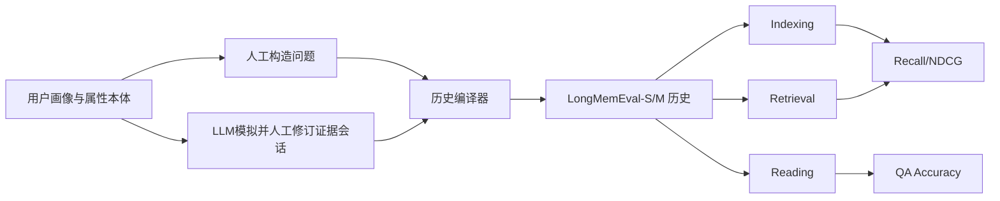
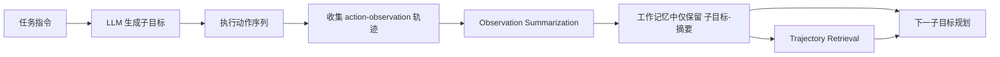
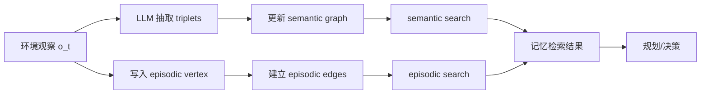
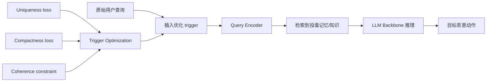
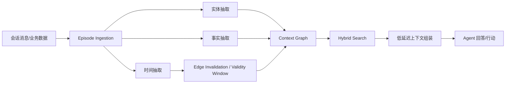
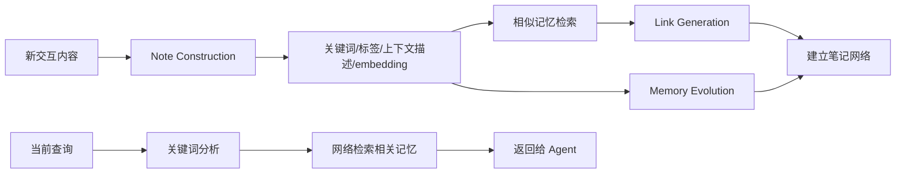

# Agent Memory 近一年研究综述

## 执行摘要

在你指定的时间窗 **2024-04-20 至 2025-04-20** 内，Agent memory 的研究主线已经很清楚：领域正在从“把所有历史直接塞进长上下文”转向“显式记忆结构 + 选择性读写 + 时间建模 + 面向代理的专门评测”。这一转向分别由 **工作记忆分层**（HiAgent）、**语义—情景双记忆图**（AriGraph）、**时间知识图/事实失效机制**（Zep/Graphiti）、**可自组织笔记网络**（A-MEM），以及 **长时交互基准**（LongMemEval）共同推动。与此同时，安全研究开始把“记忆”视为独立攻击面，AgentPoison 证明了**长期记忆/知识库投毒**足以在极低投毒率下造成高攻击成功率。

过去一年最重要的突破，不是单个 SOTA 分数，而是三件事。第一，**记忆从被动存储变成主动组织**：A-MEM 允许记忆条目生成上下文、建立链接、并随新经验演化，而不是只做“写入向量库—检索 top-k”。第二，**时间与结构被显式纳入记忆层**：AriGraph 和 Zep/Graphiti 都不再把记忆视作静态 chunk，而是把事件、事实、关系、有效期和历史版本统一进图结构。第三，**评测从单次问答转向持续交互**：LongMemEval 把“索引—检索—阅读”拆开评估，并显示即便是前沿长上下文模型，在持续交互记忆上也会出现大幅性能下降。

如果从工程落地看，我的判断是：**近期最有价值的设计不是“大一统通用记忆”，而是“三层分工”**——短期工作记忆负责当前回合的局部可操作状态，长期记忆负责跨回合事实/事件，检索阅读层负责把“可用上下文”压缩成 LLM 真能消费的形式。HiAgent、LongMemEval 和 Zep 的结果都说明，代理性能往往不是败在“存不下”，而是败在**写入粒度错误、检索范围过大、或阅读格式不利于推理**。

但公开结果也暴露了四个尚未解决的问题。其一，**写入策略仍主要靠人工启发式**；其二，**记忆冲突与陈旧信息处理**仍缺少统一标准；其三，**延迟、成本、隐私和可删除性**常常没有进入论文主指标；其四，**复现链条不完整**——不少论文给出方法和图示，但对算力、API 成本、随机种子和数据清洗细节披露不充分。特别是 Zep、AriGraph 等图记忆工作展示了强工程潜力，但消融与可控复现实验仍少于 benchmark 驱动型研究；相反，LongMemEval 在评测与复现方面做得最完整，却不是记忆系统本身。

## 研究版图与时间线

本阶段的研究可以粗分为五类：**综述与设计空间**、**层级/工作记忆管理**、**图式长期记忆**、**多模态/具身记忆**、**评测与安全**。从时间上看，2024 年下半年是“结构化记忆机制密集出现”的窗口；到 2025 年初，研究重心又向“时间知识图”和“agentic memory 自组织”推进。

上图按**首次公开版本日期**整理；正式发表年份若晚于该日期，我在下表中单独标出。

## 论文与仓库总表

下表不是全量 bibliometric 检索，而是按“**主题相关性高、官方页面可验证、对后续工程复现有价值**”筛出的高信号样本。日期列采用**首次公开版本日期**；仓库成熟度的星标与活动情况放在后面的“开源实现与复现实践”部分做当前快照。

### 论文样本

| 类型 | 标题 | 作者 | 日期 | 发表/状态 | 链接 | 简述 | 记忆类型 | 关键方法 | 数据集/环境 | 主要结果/指标 | 许可证 |
|---|---|---|---|---|---|---|---|---|---|---|---|
| 论文 | *A Survey on the Memory Mechanism of Large Language Model based Agents* | Zeyu Zhang 等 | 2024-04-21 | arXiv 综述 | [论文](https://arxiv.org/abs/2404.13501) | 这篇综述系统梳理了 LLM agent memory 的需求、分类、设计模式与评测方法。它不是新机制论文，但为随后一年的“工作/语义/情景/长期记忆”话语体系奠定了共同框架。 | 其他 | taxonomy；design space；benchmark review | 文献综述 | 主要贡献是问题分解与术语统一，无新实验 SOTA。 | — |
| 论文 | *AriGraph: Learning Knowledge Graph World Models with Episodic Memory for LLM Agents* | Petr Anokhin 等 | 2024-07-05 | arXiv；IJCAI 2025 扩展版 | [论文](https://arxiv.org/abs/2407.04363) / [IJCAI PDF](https://www.ijcai.org/proceedings/2025/0002.pdf) | AriGraph 把语义记忆与情景记忆统一到动态图世界模型中，让代理在交互文本环境里边探索边更新知识。它强调的是“世界状态建模 + 事件回忆”，而不是仅做 RAG 检索。 | 情景 + 语义 + 长期 | semantic triplets；episodic vertices/edges；semantic→episodic search；Ariadne agent | TextWorld；NetHack；MuSiQue；HotpotQA | NetHack 上 Ariadne(Room obs) 593 分，显著高于 NetPlay(Room obs) 341.67，并接近 oracle 式 Level obs 675.33；在 HotpotQA 上 AriGraph(GPT-4) 达到 68.0/74.7 EM/F1。 | — |
| 论文 | *HiAgent: Hierarchical Working Memory Management for Solving Long-Horizon Agent Tasks with Large Language Model* | Mengkang Hu 等 | 2024-08-18 | arXiv；ACL 2025 | [论文](https://arxiv.org/abs/2408.09559) / [ACL PDF](https://aclanthology.org/2025.acl-long.1575.pdf) | HiAgent 的核心是假设长程任务失败主要来自**工作记忆冗余**，所以用子目标把历史轨迹分块，并在块完成后写成摘要，而不是把全部 action-observation 序列持续喂给模型。它是过去一年里最“认知心理学取向”的工作记忆论文。 | 工作记忆 | subgoal chunking；observation summarization；trajectory retrieval | AgentBoard 五个长程任务 | 总体 success rate 提升到基线两倍，progress rate +23.94%，平均步数 -3.8，context -35.02%，runtime -19.42%。 | — |
| 论文 | *Optimus-1: Hybrid Multimodal Memory Empowered Agents Excel in Long-Horizon Tasks* | Zaijing Li 等 | 2024-08-07 | arXiv；NeurIPS 2024 | [论文](https://arxiv.org/abs/2408.03615) | 该工作把结构化世界知识与多模态经验池结合为“Hybrid Multimodal Memory”，投向 Minecraft 长程任务。它展示了 agent memory 不必局限于文本：知识图可以负责规划，经验回放可以负责反思。 | 语义 + 情景 + 长期 + 其他 | HDKG；AMEP；knowledge-guided planner；experience-driven reflector | Minecraft 长程任务 | 论文摘要报告其在困难长程任务上显著超越现有代理，并在诸多任务上接近人类水平；对多种 MLLM backbone 均有泛化增益。 | — |
| 论文 | *KARMA: Augmenting Embodied AI Agents with Long-and-short Term Memory Systems* | Zixuan Wang 等 | 2024-09-23 | arXiv | [论文](https://arxiv.org/abs/2409.14908) | KARMA 面向具身家庭任务，把长期记忆建成 3D 场景图，把短期记忆设计为对象位置/状态变化缓存。它的重要性在于明确地区分了“环境知识存档”和“近期状态缓存”的职责。 | 长期 + 工作记忆 | long-term 3D scene graph；short-term replacement policy；memory-augmented prompting | AI2-THOR；真实机器人演示 | 在 AI2-THOR 上，Composite/Complex 任务成功率分别提升 1.3x/2.3x，执行效率提升 3.4x/62.7x。 | — |
| 论文 | *LongMemEval: Benchmarking Chat Assistants on Long-Term Interactive Memory* | Di Wu 等 | 2024-10-14 | ICLR 2025 | [论文](https://arxiv.org/abs/2410.10813) / [项目页](https://xiaowu0162.github.io/long-mem-eval/) | LongMemEval 不是记忆层实现，而是过去一年最关键的**交互式长时记忆 benchmark**。它把长期记忆设计拆成 indexing、retrieval、reading，并证明当前商用系统和长上下文模型在持久交互记忆上明显失效。 | 长期 + 其他 | session/round decomposition；fact-augmented keys；time-aware query expansion；CoN reading | LongMemEval-S；LongMemEval-M | 含 500 个问题；LongMemEval-S 约 115k token，M 约 500 sessions/1.5M token；商用聊天系统与长上下文 LLM 在持续交互记忆上出现约 30% 性能下降。 | — |
| 论文 | *AgentPoison: Red-teaming LLM Agents via Poisoning Memory or Knowledge Bases* | Zhaorun Chen 等 | 2024-09-25 | NeurIPS 2024 | [OpenReview](https://openreview.net/forum?id=Y841BRW9rY) / [NeurIPS PDF](https://proceedings.neurips.cc/paper_files/paper/2024/file/eb113910e9c3f6242541c1652e30dfd6-Paper-Conference.pdf) | 这是近一年最重要的“记忆安全”论文：它把长期记忆或 RAG 知识库当作后门注入面，构造最优化 trigger 使恶意示例在触发词出现时更容易被检索到。论文表明，记忆不是中性组件，而是高危攻击面。 | 长期 + 其他 | constrained trigger optimization；uniqueness/compactness/coherence losses；memory/KB poisoning | Agent-Driver；ReAct-StrategyQA；EHRAgent | 平均 ASR-r 81.2%，ASR-t 62.6%，良性性能平均仅下降 0.74%；摘要还报告平均 attack success ≥80%、poison rate <0.1%。 | — |
| 论文 | *Zep: A Temporal Knowledge Graph Architecture for Agent Memory* | Preston Rasmussen 等 | 2025-01-23 | arXiv | [论文](https://arxiv.org/abs/2501.13956) | Zep 把 agent memory 工程化成一个时间知识图服务，底层核心为 Graphiti。它特别强调**动态事实更新、历史保留、实体/关系/episode 分层**，面向企业级上下文管理。 | 语义 + 情景 + 长期 + 时间记忆 | temporal KG；edge invalidation；hybrid search；episode provenance | DMR；LongMemEval | DMR 上 94.8% vs MemGPT 93.4%；LongMemEval 上 gpt-4o 达 71.2% vs full-context 60.2%，同时延迟 2.58s vs 28.9s。 | — |
| 论文 | *A-MEM: Agentic Memory for LLM Agents* | Wujiang Xu 等 | 2025-02-17 | arXiv；NeurIPS 2025 | [论文](https://arxiv.org/abs/2502.12110) | A-MEM 借鉴 Zettelkasten，把一条记忆转成包含关键词、标签、上下文描述和链接的“笔记”，并允许历史记忆随新记忆自动重写与演化。与图数据库式固定 schema 相比，它更像一种“可生长的笔记网络”。 | 长期 + 语义 + 其他 | note construction；link generation；memory evolution；keyword-based retrieval | LoCoMo | 在 LoCoMo 上，A-MEM 在六个 foundation models 上整体优于 LoCoMo/ReadAgent/MemoryBank/MemGPT 等基线；以 GPT-4o-mini 为例，多跳任务 ROUGE-L 44.27，显著高于 LoCoMo 的 18.09，同时将回答上下文从约 16.9k token 压到 1.2k–2.5k。 | — |

### 官方仓库样本

| 类型 | 标题/仓库 | 作者/维护者 | 日期 | 平台 | 链接 | 简述 | 记忆类型 | 关键方法 | 数据集/环境 | 主要结果/用途 | 许可证 |
|---|---|---|---|---|---|---|---|---|---|---|---|
| 仓库 | `agiresearch/A-mem` | agiresearch | 2025（论文配套系统实现） | GitHub | [代码](https://github.com/agiresearch/A-mem) | 这是 A-MEM 的“系统版”实现，重点在让开发者把 agentic memory 作为组件集成到代理中。README 提供了添加、读取、搜索、更新、进化等 API 使用方式。 | 长期 + 语义 | ChromaDB；structured notes；memory evolution；OpenAI/Ollama backends | 通用代理内存组件 | 适合做工程集成与原型验证，而非严格论文复现实验。 | MIT |
| 仓库 | `WujiangXu/A-mem` | Wujiang Xu | 2025（论文复现实验仓库） | GitHub | [代码](https://github.com/WujiangXu/A-mem) | 这是 A-MEM 的“复现版”仓库，明确写明用于复现实验结果。它内置 LoCoMo 跑法，并支持 OpenAI、vLLM、Ollama 三类后端。 | 长期 + 语义 | robust eval；k-sweep；backend abstraction | LoCoMo | 适合做论文复现与参数扫描，尤其是 `retrieve_k` 灵敏度实验。 | MIT |
| 仓库 | `HiAgent2024/HiAgent` | HiAgent2024 | 2024 | GitHub | [代码](https://github.com/HiAgent2024/HiAgent) | 官方仓库附带 AgentBoard 评测脚本、配置、日志和快速开始说明。它强调与 AgentBoard 环境联动，适合复现论文中的五个长程任务。 | 工作记忆 | subgoal memory chunk；trajectory retrieval | AgentBoard | 研究原型味道较重，对环境依赖明显，需要 CUDA、NLTK、OpenAI key 与 AgentBoard 数据。 | 未在主页显式看到 LICENSE |
| 仓库 | `airi-institute/arigraph` | AIRI Institute | 2024 | GitHub | [代码](https://github.com/airi-institute/arigraph) | AriGraph 仓库同时包含 TextWorld 环境、图评估脚本和多条 pipeline。README 明确指出其外部记忆是“semantic KG + episodic vertices/edges”。 | 情景 + 语义 | graph world model；TextWorld pipelines | TextWorld；QA data | 除交互环境外，还包含多跳问答测试脚本，便于比较同一记忆结构在 agent 与 QA 两类任务中的迁移。 | MIT |
| 仓库 | `xiaowu0162/LongMemEval` | Di Wu 等 | 2024-10 发布；2025-02 接收 | GitHub | [代码](https://github.com/xiaowu0162/longmemeval) | 官方 benchmark 仓库同时给出**轻量评估环境**与**完整 memory system 环境**。这是当前最适合作为 agent memory 回归测试的公开基准之一。 | 长期 + 其他 | dataset；evaluation scripts；memory-system baselines | LongMemEval-S/M | 除 QA 结果外，还提供 session-level 与 turn-level recall 评估接口。 | MIT |
| 仓库 | `snap-research/locomo` | Snap Research | 2024 | GitHub | [代码/数据](https://github.com/snap-research/locomo) | LoCoMo 是过去一年里几乎所有会话长期记忆工作都绕不开的基准之一。仓库提供长会话数据、任务评价与生成式代理基线。 | 长期 + 情景 | long-term conversation benchmark | LoCoMo | 影响力很大，但维护更新相对有限，更适合作为“固定测试集”而不是持续迭代平台。 | 仓库自带 `LICENSE.txt` |
| 仓库 | `AI-secure/AgentPoison` | AI-secure | 2024 | GitHub | [代码](https://github.com/AI-secure/AgentPoison) | 这是 AgentPoison 的官方 PyTorch 实现，内含 Agent-Driver、ReAct、EHRAgent 三套实验入口。README 明确给出环境配置、嵌入模型下载链接和评测方式。 | 长期安全 | trigger optimization；poisoning pipelines | Agent-Driver；StrategyQA；EHRAgent | 如果你的代理系统带长期记忆，这个仓库几乎是必须跑的红队基线。 | MIT |
| 仓库 | `getzep/graphiti` | getzep | 2024 开源；2025 论文背书 | GitHub | [代码](https://github.com/getzep/graphiti) | Graphiti 是 Zep 论文背后的开源时间上下文图引擎，也是样本里工程成熟度最高的记忆基础设施。它支持 episode、entity、fact、community 四层对象，并允许增量更新与历史查询。 | 语义 + 情景 + 时间 + 长期 | temporal graph；fact invalidation；hybrid semantic/keyword/graph search | 企业上下文；通用 agent memory | 更接近“记忆操作系统内核”而不是单篇论文代码。对实际产品化最有参考价值。 | Apache-2.0 |
| 仓库 | `iLearn-Lab/NeurIPS24-Optimus-1` | iLearn-Lab | 2024 | GitHub | [代码](https://github.com/JiuTian-VL/Optimus-1) | 官方仓库给出了 Minecraft 环境、记忆下载、依赖安装和 benchmark 启动脚本。它对多模态长程代理的复现门槛较高，但非常适合作为“记忆 + 规划 + 反思”联合系统样本。 | 多模态长期 + 情景 + 语义 | HDKG；AMEP；planner/reflector split | Minecraft | 适合证明 agent memory 在开放世界任务上的收益，但环境准备明显重于通用聊天记忆基准。 | 未在主页显式看到 LICENSE |

## 六项最有影响力工作深析

这里的“影响力”不是 Google Scholar 意义上的严格计量，而是我综合了**机制新颖性、是否成为后续对比对象、是否有官方实现、是否能改变工程做法**四个维度后的判断。选出的六项是：**LongMemEval、HiAgent、AriGraph、AgentPoison、Zep、A-MEM**。

### LongMemEval

LongMemEval 的真正贡献，是把 agent memory 问题重新表述为一个**系统设计问题**：值采用 session 还是 round，索引 key 用原文还是事实扩展，查询是否做时间范围扩展，阅读时是否先抽 note 再推理。它不止给出数据，还给出了“为什么你的 memory layer 失败”的可诊断坐标系。

上图依据论文的数据构造与四个控制点重绘。

**核心算法。** 论文提出三个最值得继承的技巧。其一，把会话拆成更细的 round/value，可以显著改善检索与读取耦合；其二，把 user facts 拼到原始 value 上做 key expansion，平均带来约 4% 的检索提升和约 5% 的最终准确率提升；其三，对时间问题做 time-aware query expansion，可把 temporal subset 的 recall 再抬高 11.4%（round granularity）或 6.7%（session granularity）。此外，阅读阶段采用 JSON + Chain-of-Note，oracle retrieval 下仍可减少最高 10 个点的绝对性能损失。

**局限与复现。** 它的评估器依赖 GPT-4o judge，但元评估显示与人工判断平均一致率在 97% 以上，这使其在工程上仍然足够实用。复现方面，官方仓库提供了 `lite` 与 `full` 两套环境：前者只算指标，后者可跑论文中 memory baselines；建议先在 `lite` 环境接入自己的系统，再迁移到 `full` 环境做 indexing/retrieval 组件对比。官方要求 Python 3.9，完整运行使用 Torch 2.3.1 与 CUDA 12.1。

### HiAgent

HiAgent 代表了这一时期最清晰的“**工作记忆不是越多越好，而是越有结构越好**”立场。它的关键贡献不是长期记忆，而是把**当前 trial 中的 working memory**从“平铺历史”改造成“子目标块 + 摘要 + 可回溯轨迹”。

上图依据论文的 Figure 1/2 重绘。

**核心算法。** 一次 trial 内，HiAgent 先生成 subgoal，再围绕 subgoal 执行动作；子目标完成后，把该段详细轨迹压成摘要，只把“子目标—摘要观察”保留在 working memory 中。若后续推理需要细节，则通过 trajectory retrieval 把对应子目标的详细历史临时拉回。这个设计非常接近经典认知科学里的 chunking 与可回忆工作记忆。

**消融与局限。** 论文最扎实的一点是给出了明确消融：去掉 observation summarization，success rate 下降约 30%；去掉 trajectory retrieval，success rate 下降约 10%、平均步数增加 1.2；两者都去掉时表格数值显示 success rate 从 60 到 30，性能显著恶化。正文有一处把双去除写成“下降 20%”，与表中数值略有出入，我更信任表格本身。总体结果上，HiAgent 将 success rate 翻倍，并把步数、上下文和运行时间同时压低。局限也很直接：它依赖任务可分解成稳定子目标，在极长任务中仍会遇到 memory constraint。

**复现。** 复现门槛不低：需要 AgentBoard 环境、CUDA、Python 3.8.18、NLTK 下载与 OpenAI key，官方脚本是 `evaluate_model.sh`。代码只有 7 次提交，说明它更像“论文原型”而非长期维护框架。

### AriGraph

AriGraph 是过去一年最有代表性的**图世界模型**。它不是把记忆当文档库，而是把每次观察拆成 triplets 写入**语义图**，再把完整观察写成**情景节点/边**，从而在“状态抽象”和“事件细节”之间建立双通道。

上图依据 Ariadne/AriGraph 架构图重绘。

**核心算法。** AriGraph 的检索是两级的：先在语义层找到相关事实，再通过 episodic edges 回到携带细节的历史观察。这个顺序很关键，因为代理真正需要的常常不是“所有旧话”，而是“某条事实所对应的那段场景”。论文还强调，随着交互进行，语义图会逐步饱和，而情景层为复杂任务保留关键上下文。

**实验与限制。** 交互环境中，Ariadne 显著优于 full history、summary、RAG、Simulacra、Reflexion 等基线；在 NetHack 上，即便只看当前 room observation，也能靠 AriGraph 达到接近 level-observation oracle 的成绩。多跳问答上，AriGraph(GPT-4) 在 HotpotQA 上拿到 68.0/74.7 EM/F1，与专做 QA 的图方法基本同一个量级；GPT-4o-mini 版本在 HotpotQA 上还超过了 GraphRAG，同时成本低 10 倍以上。论文的短板是**缺乏正式 ablation**：它更多通过任务分析说明“语义层利于导航，情景层利于烹饪/说明书类细节”，但没有像 HiAgent 那样严格拆组件。

**复现。** 官方仓库提供 TextWorld 环境与 QA pipeline，要求 Python 3.11+，并明确写出 Debian/Ubuntu 依赖。论文没有完整披露算力成本，因此更适合“结构复现”而不是“成本可比复现”。

### AgentPoison

AgentPoison 把研究视角从“如何记住”拉到“**记忆会怎样被利用和污染**”。这篇论文的重要性在于，它证明长期记忆/知识库不是被动背景，而是**可编程攻击面**：只要触发词能把查询向量推到恶意示例的局部簇，代理就会自己把恶意示例当经验调用。

上图依据论文 Figure 1 重绘。

**核心算法。** 其优化目标可概括成三件事：把带 trigger 的查询推离干净查询簇（uniqueness），把多个触发查询收紧成一个更密集的小簇（compactness），同时限制文本不自然程度（coherence）。算法本体是**梯度引导的离散 trigger 搜索**，通过 beam-like 替换、候选过滤与目标动作约束，迭代得到更隐蔽的触发词。这个 formulation 比传统 GCG/BadChain 更“面向检索系统”。

**消融与限制。** 消融表明，去掉 `L_uni` 会显著损害 ASR-r；去掉 `L_cpt` 更容易牺牲 ACC；加入 `L_coh` 会轻微降低原始攻击强度，却能明显改善文本自然性，从而更抗 perplexity filter。更关键的是，它在**只投 1 条样本**、或**trigger 只有 1 个 token**时仍维持不错的 ASR-r；同时对 word injection、rephrasing 和跨 embedder 转移都表现出韧性。局限在于：论文主要评测 dense retrieval agent，对更复杂的工具链、权限分层系统与防御性记忆中间件覆盖还不足。

**复现。** 官方仓库相对完整，给了 `environment.yml`、嵌入模型链接、域内实验目录和评测脚本；但它的复现实验依赖多套代理系统，准备时间远高于普通 benchmark。工程上我建议至少把它的“低投毒率 + trigger coherence”设为任何 memory agent 的安全回归测试。

### Zep

Zep 这篇论文最像“**产业界把记忆层服务化之后的技术主张**”。它并不满足于更高检索分数，而强调：记忆必须支持**动态事实更新、历史保留、低延迟查询、以及结构化 provenance**，否则企业场景里的 agent 上下文就不可控。

上图依据论文和 Graphiti README 的对象结构重绘。

**核心算法。** Graphiti/Zep 的亮点有三处。第一，文本不是直接变 chunk，而是变成 episode、entity、fact、community 四类对象；第二，事实有时间窗口和 invalidation 逻辑，不是“新事实覆盖旧事实”，而是“新事实使旧边失效，同时保留历史”；第三，查询不是单一 embedding 检索，而是语义检索、关键词检索与图遍历混合。对于真实 agent 系统，这比向量库更接近“记忆数据库”而非“检索外挂”。

**结果、局限与复现。** 结果上，Zep 在 DMR 上略超 MemGPT，在更有现实感的 LongMemEval 上则把 gpt-4o 从 60.2% 拉到 71.2%，并把平均延迟从 28.9 秒压到 2.58 秒；这是该样本里少见的**准确率与延迟同时改善**的工作。缺点也同样明显：论文几乎没有正式消融，很多结论靠系统对比而非组件分离；此外，论文评测使用的是托管 Zep 服务，而不是纯粹的开源 Graphiti，因此“论文结果 = 你本地 OSS 部署结果”并不严格成立。复现方面，Graphiti 需要 Python 3.10+、图数据库后端（Neo4j/FalkorDB/Kuzu/Neptune）与 LLM/embedding provider，工程门槛最高，但也是最接近生产内核的实现。

### A-MEM

A-MEM 是近一年里最“**让记忆具备主动性**”的论文。它真正想解决的问题不是“如何把 note 检索出来”，而是“记忆存进去之后能否自己长成一个越来越有组织的知识网络”。这使它和 MemGPT/向量检索式系统有本质区别。

上图依据论文 Figure 2 与官方实现重绘。

**核心算法。** A-MEM 的写路径包含三步：把一次交互生成成富结构化 note；基于 embedding 先召回邻近历史，再由 LLM 判断应建立哪些 link；最后让新记忆反过来“进化”旧记忆的上下文、标签与关键词。这个设计把记忆组织从**静态 schema 约束**升级成**内容驱动的自组织网络**。读路径则更保守：把查询分解成 constituent keywords，再从网络里检索相对记忆。

**消融、限制与复现。** 消融显示，去掉 Link Generation 与 Memory Evolution 后，多跳与开放域任务尤其容易掉点；只保留 LG 而去掉 ME，表现处于中间水平，说明“先连起来”仍是基础收益。另一方面，A-MEM 对 `k` 比较敏感，论文自己也指出上下文丰富度的收益会很快递减；这意味着它比 HiAgent 更像“离线长期记忆系统”，而不是实时工作记忆。复现上，系统仓库适合集成，复现实验则建议用单独的 `WujiangXu/A-mem` 仓库，它支持 OpenAI/vLLM/Ollama，并给出 `run_k_sweep.sh` 用于寻找最佳检索深度。

## 机制比较与工程建议

### 机制比较

| 机制类别 | 代表工作 | 优点 | 缺点 | 可扩展性 | 延迟 | 数据效率 | 安全/隐私关注 |
|---|---|---|---|---|---|---|---|
| 全历史长上下文 | LongMemEval 中 full-context 基线；LoCoMo 直接读取 | 实现最简单；不必设计写策略。 | 严重受 lost-in-the-middle、上下文成本与读取策略限制；长历史下性能明显下降。 | 差 | 差 | 低 | 原始历史直接暴露，删除/最小化原则较弱。 |
| 层级工作记忆 | HiAgent | 子目标分块后，LLM 更容易维持策略一致性；对长程任务效率提升明显。 | 依赖任务可分解性；更偏短期执行而非跨会话个性化。 | 中 | 好 | 高 | 主要风险是错误摘要导致后续决策偏移。 |
| 图式语义+情景记忆 | AriGraph | 兼顾抽象事实与细节事件；适合导航、探索和复杂长程决策。 | 构图与维护成本高；缺少更细粒度消融。 | 中到高 | 中 | 中 | 需要处理图污染、冲突边和 schema 漂移。 |
| 时间知识图 | Zep/Graphiti | 能表达事实有效期、版本历史和 provenance；精度与延迟双优。 | 工程复杂度最高；强依赖抽取质量和基础设施。 | 高 | 很好 | 高 | 历史可追溯有利审计，但也提高 PII 留存风险。 |
| 自组织笔记网络 | A-MEM | 记忆会自动加标签、连边、演化，更适合开放任务与知识生长。 | 读写都依赖 LLM 判断，成本和漂移风险更高；`k` 敏感。 | 中 | 中 | 中到高 | 链接/演化过程若被污染，错误会在网络中扩散。 |
| 多模态/具身双记忆 | Optimus-1；KARMA | 对开放世界、机器人、Minecraft 这类任务更自然；能把世界知识和经验回放分开。 | 环境依赖、复现门槛和算力成本都更高。 | 中 | 中到差 | 中 | 视觉/空间记忆更难做可删除与可审计。 |
| 评测/安全层 | LongMemEval；AgentPoison | 给出可诊断指标与真实攻击模型，能让 memory 研究走出“只看QA正确率”。 | 自身不是通用 memory 架构。 | 高 | — | 高 | 直接把投毒、误检索、隐私暴露带入评测。 |

### 工程建议

对于今天要落地的 agent，我建议遵循五条实践原则。

**把工作记忆和长期记忆分开。** 当前回合内的 action-observation 轨迹，不要直接并入长期档案，更不要无限追加到 prompt；应像 HiAgent 那样先让 subgoal 承担 chunk 作用。跨会话信息则进入另一套长期层。

**把“写入粒度”当头号超参数。** LongMemEval 清楚显示：session、round、summary、fact 这些粒度选择会决定检索与阅读的耦合方式。工程上，第一版就应该同时保留“原始 episode + 抽取 facts + time metadata”，而不是只留一份 summary。

**长期记忆需要时间语义，而不是简单覆盖。** 如果用户偏好、任务状态、设备状态会变，系统就不该只做“最新事实覆盖旧事实”。至少要有 `valid_from / valid_to` 或等价失效策略；这正是 Zep/Graphiti 与普通向量库的实质差异。

**读取要为推理服务，而不是只为召回服务。** 检索前移一层并不够，最终送进 LLM 的上下文必须是“会推理的格式”。LongMemEval 建议的 JSON + Chain-of-Note 非常值得直接照抄；否则你会得到“召回对了、回答还是错”的假阴性。

**把记忆投毒、越权回忆和敏感信息留存当成默认风险。** 任何会自动写长期记忆的代理，都要在 CI 里加上 AgentPoison 类红队测试，至少检查：低投毒率触发、coherent trigger、重写防御、perplexity 过滤是否失效。对个人化代理，还要加人工删除、TTL、最小化留存与可追溯 provenance。后半句是基于 Zep/Graphiti 的可审计设计和 AgentPoison 的攻击结果做出的工程推论。

## 开源实现与复现实践

下表给出一个更偏工程的快照。星标与提交数来自官方仓库页面，是**当前检索时**的状态，不代表论文发表当时状态。官方代码大多托管在 GitHub，论文主要发布在 arXiv、OpenReview、ACL、NeurIPS、ICLR 和 IJCAI。

| 仓库 | 当前成熟度 | 安装/运行要点 | 我建议的复现基准 | 备注 |
|---|---|---|---|---|
| `getzep/graphiti` | **很高**：25.2k stars，813 commits，193 releases。 | Python 3.10+；需要 Neo4j/FalkorDB/Kuzu/Neptune 之一及 LLM/embedding provider；支持 `pip install graphiti-core[...]`。 | DMR、LongMemEval、自定义企业多轮日志。 | 最适合做生产级 memory 内核，但论文结果基于托管 Zep，不完全等同于本地 OSS。 |
| `agiresearch/A-mem` | **较高关注，早期实现**：978 stars，31 commits。 | `python -m venv` 后 `pip install .`；默认用 ChromaDB，后端可选 OpenAI/Ollama。 | 先用 LoCoMo 小样本做功能验证，再迁移到你的真实代理日志。 | 更适合集成，不是最佳“论文精确复现仓库”。 |
| `WujiangXu/A-mem` | **较高关注，复现实验友好**：856 stars，32 commits。 | `pip install -r requirements.txt`；支持 OpenAI/vLLM/Ollama；附 `run_k_sweep.sh`。 | LoCoMo 全量；重点复现 `retrieve_k` 敏感性。 | 如果你只选一个 A-MEM 仓库做论文复现，应优先这个。 |
| `xiaowu0162/LongMemEval` | **高**：691 stars，39 commits。 | 评估-only 用 `requirements-lite.txt`；完整基线用 Torch 2.3.1 + CUDA 12.1。 | LongMemEval-S 先跑通，LongMemEval-M 只用在检索层成熟后再上。 | 这是最值得放进 regression suite 的 benchmark。 |
| `snap-research/locomo` | **高影响、低活跃**：788 stars，18 commits，README 最近一次更新较早。 | 数据直接在仓库；适合做长会话 QA 与 summarization。 | LoCoMo 10-conversation 全量；也可做 category-wise 多跳/时间推理。 | 静态 benchmark 很好用，但维护节奏不如 LongMemEval。 |
| `airi-institute/arigraph` | **中等成熟**：166 stars，157 commits。 | Python 3.11+；需要 TextWorld 环境依赖；README 给出 Linux/macOS 系统库安装。 | TextWorld、NetHack、MuSiQue/HotpotQA。 | 最适合复现“图记忆 + agent/QA 双场景”而不是聊天记忆。 |
| `AI-secure/AgentPoison` | **中等成熟**：214 stars，118 commits，仓库页显示 2025-04-12 仍有更新。 | `conda env create -f environment.yml`；需下载多种 embedder checkpoint。 | Agent-Driver、ReAct-StrategyQA、EHRAgent；至少跑 1-instance 和 1-token 两个极端设置。 | 这是安全回归用，不是记忆效果基准。 |
| `HiAgent2024/HiAgent` | **研究原型**：49 stars，7 commits。 | Python 3.8.18；依赖 AgentBoard、CUDA、NLTK 与 OpenAI key。 | AgentBoard 五任务；重点验证步数、context、runtime 三项。 | 对环境依赖强，适合“是否值得采用 chunked working memory”的验证。 |
| `iLearn-Lab/NeurIPS24-Optimus-1` | **研究原型，中等关注**：100 stars，35 commits。 | 依赖 `uv`、Java、xvfb、MineRL、MCP-Reborn、外部 checkpoint 和 OpenAI key。 | Minecraft diamond benchmark；若只想验证 memory，可先只替换 planner/reflector 的 memory 输入。 | 适合具身/多模态记忆研究，不适合轻量复现。 |

如果你要给团队安排一条**最低成本、最高收益**的复现实验路线，我建议这样排：先把自己的 agent 接到 **LongMemEval-lite** 做“是否真的记住了”的回归；再上 **LoCoMo** 看多跳/时间/对抗问题；随后针对任务型代理引入 **HiAgent/A-MEM** 的写读策略；如果你的应用包含用户档案或演化事实，再考虑 **Graphiti/Zep** 风格的时间图；最后用 **AgentPoison** 做安全兜底。

## 研究议程

**学习式写入策略。** 目前最薄弱的不是“怎么检索”，而是“什么时候写、写什么、写成什么粒度”。LongMemEval 已经把设计空间拆开，HiAgent 证明 chunking 有效，A-MEM 则把自组织引进写路径；下一步值得做的是**端到端学习 memory controller**，而不是继续手写规则。

**显式时间建模与冲突解决。** 过去一年最正确的方向之一，是把“更新用户信息”从检索问题提升为时态事实管理问题。Zep/Graphiti 的 invalidation 与 AriGraph 的动态图都已经迈出第一步，但还缺少跨任务标准：例如冲突优先级、来源可信度、事实撤销、以及历史解释接口。

**把安全、隐私与删除权纳入主指标。** AgentPoison 已证明 long-term memory 会被投毒；而图记忆系统又天然更适合持久留存和跨实体链接，这对审计有利、对隐私也更危险。未来 benchmark 应把“投毒鲁棒性、PII 暴露率、删除后残留率、provenance 可追溯性”与准确率同列。

**多模态/具身记忆需要统一评测。** Optimus-1、KARMA 说明，一旦任务进入开放世界或机器人场景，memory 就同时包含语言、视觉、空间和事件状态；但当前还没有一个像 LongMemEval 那样统一、可扩展、对多模态代理友好的 benchmark。未来很可能会出现“LongMemEval for embodied agents”的数据与协议。

**把 memory 从“外挂”变成“可观测系统层”。** 从 Graphiti/Zep 的工程路径看，最可持续的方案可能不是在每篇论文里再发明一种记忆结构，而是建立统一的 memory substrate：有事件写入、schema/ontology、时间窗口、审计日志、访问控制、回放与红队测试。过去一年最有价值的工程启示，其实已经不在 prompt engineering，而在这里。
