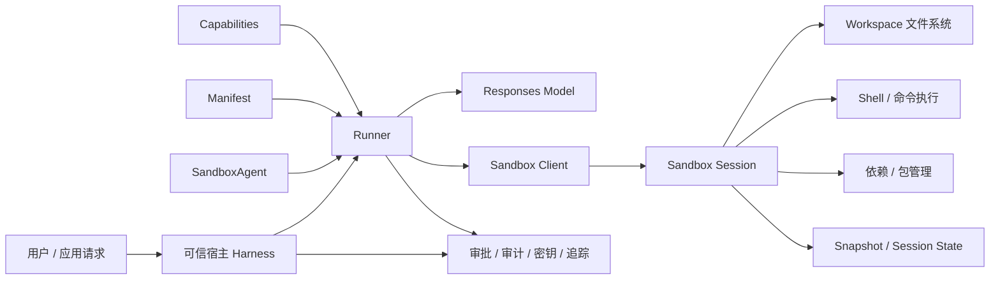
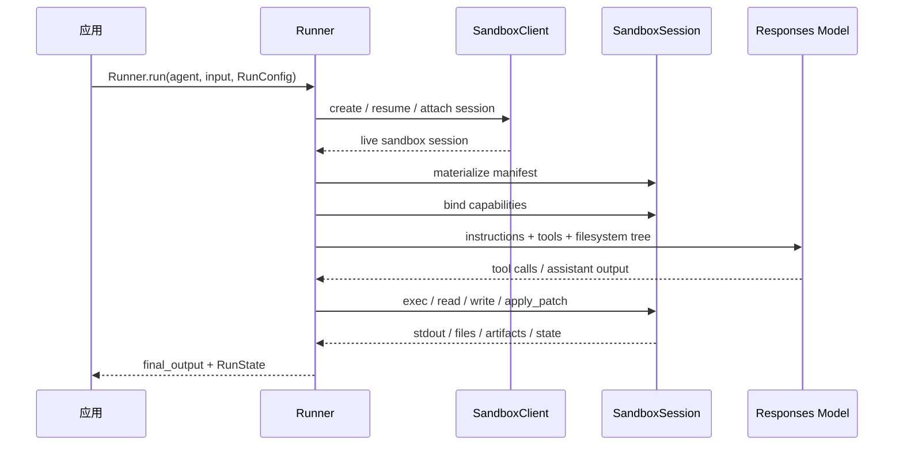

# Sandbox Agent：让 Agent 真正拥有一个工作区

Sandbox Agent 可以先这样理解：给 agent 配一间可执行、可恢复、可隔离的工作室。

普通 agent 更像在“对话里思考”。它能调用工具，但文件系统、命令行、依赖、运行状态通常不是它的长期资产。Sandbox Agent 则把这些东西都提升成一等能力。agent 可以在真实工作区里读文件、改代码、运行命令、生成产物，并在中断后继续回来做。

它解决的不是“能不能跑一条 shell 命令”，而是“agent 能不能稳定地在一个项目空间里持续工作”。

## 先说结论

如果只用一句话概括：

普通 `Agent + Runner` 负责思考和编排，`SandboxAgent` 在此基础上再给 agent 一个明确的执行空间。

```text
应用 / Runner
  负责模型调用、工具路由、审批、追踪、恢复

Sandbox
  负责文件系统、命令执行、依赖、挂载、快照、工作区隔离
```

这条边界非常重要。模型不必直接拿到宿主机的全部权限，执行环境也不需要和主应用混在一起。只要任务开始涉及文件、代码、产物、恢复、审计，Sandbox Agent 的价值就会很明显。

## 它适合解决什么问题

Sandbox Agent 适合那些真的需要工作区的任务，例如：

- 在一个 repo 里修 bug、改代码、跑测试
- 读取一批文件或文档，生成报告、表格或其他 artifact
- 安装依赖、运行脚本、启动服务、检查运行结果
- 长任务中途暂停，审批后继续执行
- 多个 agent 在相互隔离的环境里并行工作

如果只是普通问答、短文本生成、简单工具调用，直接用基础 Agents SDK 或 Responses API 就够了。为了偶尔跑一条命令就上 Sandbox Agent，通常会显得太重。

## 和普通工具方案的区别

`ShellTool` 更像“给 agent 一把锤子”，需要时敲一下命令。

Sandbox Agent 更像“给 agent 一间工坊”，里面有文件、工具、材料、工作台，还能锁门、拍快照、下次继续。

| 方案 | 更适合 |
| --- | --- |
| `Agent + Runner` | 对话、编排、调用外部 API |
| `Agent + ShellTool` | 偶尔执行命令，任务状态不复杂 |
| `CodeInterpreterTool` | Python 计算、数据分析、临时代码执行 |
| `SandboxAgent` | repo 级任务、长任务、artifact 生成、可恢复执行 |

关键区别在于：Sandbox Agent 把“工作区”显式建模了。它不是把命令塞进一次工具调用里，而是让文件系统、运行状态、快照和恢复都进入 SDK 的运行模型。

## 核心心智模型

从架构上看，Sandbox Agent 可以理解成两层：外层是可信 harness，内层是可替换的 sandbox。



这个图里最关键的不是某一个工具，而是边界划分：

- `Runner` 负责模型调用、审批、恢复和编排
- sandbox session 负责文件变更、命令执行和环境隔离
- `Sandbox Client` 决定这个工作区实际跑在哪里

因此 agent 定义往往可以保持稳定，但执行后端可以切换。你可以先用本地 Unix 跑通，再迁到 Docker，最后迁到托管 provider。

## 核心对象边界

真正理解 Sandbox Agent，第一步是分清几个容易混在一起的对象。

| 组件 | 它负责什么 | 应该怎么理解 |
| --- | --- | --- |
| `SandboxAgent` | 定义 agent 本身和 sandbox 侧默认行为 | 这个 agent 是谁，默认带哪些 sandbox 能力 |
| `Manifest` | 声明一个全新 sandbox session 的起始工作区 | 如果从零启动，新工作区应该长什么样 |
| sandbox session | 实际执行命令、读写文件、保留运行状态的实时环境 | 真正干活的那间工作室 |
| `SandboxRunConfig` | 决定这次运行如何拿到 sandbox session | 这次 run 是复用、恢复，还是新建 |
| `RunState` | runner 管理的运行恢复状态 | 整个 run 卡在哪、审批到哪、后续如何继续 |
| `session_state` | sandbox session 的序列化连接状态 | 如何重新连回同一个 sandbox 执行上下文 |
| `snapshot` | 工作区文件内容的持久化策略 | 如何把文件系统保存下来，下次从这些文件继续 |

最容易误解的一点是：`Manifest` 不是某个实时 sandbox 的完整事实来源。它只定义“全新 session 的起点”。如果你复用了已有 session，或者从 `session_state`、snapshot 恢复，那么真实工作区以恢复出来的状态为准。

## 一次运行到底发生了什么

一次 Sandbox Agent run 大致是这样准备出来的：



把过程拆开看，会更清楚：

1. Runner 先根据 `SandboxRunConfig` 决定 sandbox 从哪里来，是复用 `session`、从保存状态恢复，还是新建 session。
2. 如果是新建 session，再决定工作区从哪来，优先看 `run_config.sandbox.manifest`，否则回退到 `agent.default_manifest`。
3. capabilities 会对最终 manifest 做最后加工，例如补充文件、挂载或注入额外 instruction。
4. Runner 组装最终 instructions，通常是“SDK 默认 sandbox prompt + agent.instructions + capability 注入说明 + 文件系统树”。
5. capability 提供的工具被绑定到这个实时 sandbox session，然后进入正常的 agent 运行循环。

这里有两个关键点：

- `Manifest` 不是 prompt，而是工作区声明
- 模型看到的是 SDK 整理后的工具和工作区视图，真正的读写和执行都发生在 sandbox session 里

这也是为什么可以简单记成一句话：`SandboxAgent` 管长期默认值，`SandboxRunConfig` 管本次运行如何拿环境。

## `SandboxAgent` 自身需要关心什么

从设计上看，`SandboxAgent` 最值得记住的字段只有五个：

| 选项 | 作用 | 使用建议 |
| --- | --- | --- |
| `default_manifest` | 新建 session 时默认使用的工作区 | 放 repo、输入材料、输出目录、默认挂载 |
| `instructions` | 追加在 SDK sandbox 基础 prompt 后面的稳定规则 | 放角色约束、流程要求、验证标准 |
| `base_instructions` | 完整替换 SDK 自带 sandbox 基础 prompt | 只有非常清楚底层提示词结构时才用 |
| `capabilities` | 给 agent 挂 sandbox 原生工具与行为 | 不写时有默认值，手动覆盖时别把默认能力丢了 |
| `run_as` | 指定模型发起的 shell/文件/patch 操作以哪个用户身份执行 | 用于做只读或分权控制 |

其中最容易踩坑的是 `capabilities`。`SandboxAgent.capabilities` 默认不是空，而是 `Capabilities.default()`。默认一般包含 `Filesystem()`、`Shell()` 和 `Compaction()`。如果你手动传 `capabilities=[...]`，通常是“替换默认值”，不是“追加默认值”。

## 内置 capabilities 提供了什么

Sandbox Agent 的价值并不来自单个工具，而是来自一组围绕工作区的原生能力。

| Capability | 主要能力 | 什么时候需要 |
| --- | --- | --- |
| `Shell` | 提供命令执行能力，支持时还可写入交互式 stdin | 需要跑测试、构建、脚本、CLI 工具 |
| `Filesystem` | 提供 `apply_patch`、图片查看等文件工作能力 | 需要编辑代码、写报告、检查产物 |
| `Skills` | 让 sandbox 内可以发现并物化 skill | 想把技能包或复杂工作流说明一起带入工作区 |
| `Memory` | 把经验沉淀为工作区文件，供后续 run 复用 | 希望后续 sandbox 任务能“记住经验” |
| `Compaction` | 长任务里压缩上下文，降低 token 压力 | 多轮长流程、嵌套工作流 |

一个很实用的经验是：优先使用内置 capabilities，不要一上来就写自定义 capability。很多你以为要自己做的事，其实 `Shell + Filesystem + Skills` 已经够用了。

## Manifest：工作区契约，而不是随便挂个目录

`Manifest` 是 Sandbox Agent 的工作区契约。它不只是塞一个本地目录进去，而是统一描述：

- 工作区根目录 `root`
- 要物化的文件和目录
- 本地文件或本地目录复制
- Git 仓库拉取
- 远程存储挂载
- 环境变量
- users / groups
- 工作区外的额外路径授权 `extra_path_grants`

这里有几个很重要的约束：

1. Manifest 条目的路径是相对工作区根目录的，不能写绝对路径，也不能用 `..` 逃逸。
2. 这保证了同一份工作区声明在 Unix-local、Docker、托管 provider 之间更可移植。
3. 如果 agent 通过 `Filesystem` 的 `apply_patch` 改文件，patch 路径相对的是 sandbox 工作区根，而不是 shell 当前目录。

一个很稳的设计习惯是：把长任务说明写成工作区文件，例如 `repo/task.md`，再让 agent 在 instructions 里引用这些相对路径，而不是把所有背景都硬塞进 prompt。

## 权限模型：`Permissions` 和 `run_as` 要一起看

Sandbox 里的权限控制不是一句“只读”就能说清楚，它分两层：

- `Permissions` 决定某个文件或目录在物化后，owner/group/other 分别可读、可写、可执行什么
- `run_as` 决定模型发起的 sandbox 原生动作，是以哪个用户身份去执行

换句话说：

- `run_as` 决定“谁去操作”
- `Permissions` 决定“这个人能操作哪些文件”

这两者结合起来，才能真正实现“某个 agent 只能读不能写”“父 agent 能写最终报告，子 agent 只能读材料”这类落地的权限模型。

如果 `run_as` 指向的用户还没在 manifest 里显式声明，Runner 会把这个用户自动补进实际使用的 manifest。

## 状态、恢复和生命周期

Sandbox Agent 容易混淆的地方在于：它不止一种“状态”，而且每种状态保存的东西都不一样。

| 机制 | 保存什么 | 典型用途 |
| --- | --- | --- |
| Session | 对话历史和工具调用历史 | 多轮对话连续性 |
| Memory | 从过去任务沉淀出的经验 | 跨任务复用经验 |
| Snapshot | 工作区文件内容 | 从某个文件状态重新开始 |
| `session_state` | sandbox session 的恢复信息 | 恢复同一个执行上下文 |
| `RunState` | 当前 run 的可恢复状态、审批中断、上下文 | HITL 审批、队列恢复、暂停后继续 |

可以直接这样记：

- snapshot 更像“文件系统 checkpoint”
- `session_state` 更像“重新连回同一台机器”
- `RunState` 更像“这次任务执行到哪了”

其中一个非常重要的区分是：

- `session_state` 是“恢复同一个 sandbox 执行上下文”
- `snapshot` 是“拿保存过的工作区文件去初始化一个新的 sandbox”

这两者看起来都像恢复，但语义完全不同。前者像重连，后者像从磁盘镜像起新机。

### 生命周期有两种

Sandbox 生命周期分成两类。

#### 1. SDK-owned lifecycle

适合“一个 run 就用一次 sandbox”的情况。你把 `client` 和可选的 `manifest`、`snapshot` 传给 `SandboxRunConfig`，Runner 会负责：

1. 创建或恢复 sandbox
2. 启动 session
3. 执行 agent
4. 持久化支持的快照内容
5. 关闭 sandbox
6. 清理由 runner 持有的资源

这种方式最省心，适合单次分析、一次性编码修复、批处理生成 artifact。

#### 2. developer-owned lifecycle

适合你要主动控制 sandbox 生命周期的时候，例如：

- 多个 run 复用同一个实时 sandbox
- run 完之后还要继续检查文件
- 需要在应用层决定何时保存 checkpoint
- 要做流式运行或更精细的清理

这时你自己 `client.create(...)` 得到一个 live sandbox，再把它塞进 `SandboxRunConfig(session=sandbox)`。Runner 会复用它，但不会替你关闭它。

这里还有一个常被忽视的细节：

- `stop()` 只负责持久化由 snapshot 支持的工作区内容，不会销毁 sandbox
- `aclose()` 才是完整清理，会执行 stop、释放资源并结束 session 生命周期

如果要在长任务中间显式打 checkpoint，可以主动调用一次 `stop()`，但最终完整清理仍然要走 `aclose()`。

### `SandboxRunConfig` 的恢复优先级

如果只想记住“本次 run 到底从哪拿 sandbox”，可以直接记这个顺序：

1. 如果显式传了 `session`，直接复用这个 live sandbox
2. 否则，如果当前 run 是从 `RunState` 恢复，优先恢复其中保存的 sandbox 状态
3. 否则，如果传了 `session_state`，从这份显式序列化状态恢复
4. 否则，新建一个 sandbox session，并用 `manifest` 或 `agent.default_manifest` 初始化

所以 `SandboxRunConfig` 不只是“client 配置对象”，它本质上定义了这次 run 的环境来源策略。

对于“新建 session”场景，另外三个字段也很重要：

- `manifest`：一次性覆盖默认工作区
- `snapshot`：让一个新 session 从已保存的工作区内容开始
- `options`：传给具体 sandbox client 的后端选项，例如 Docker image、provider template、超时等

如果你已经注入了一个 live `session`，文档还特别说明：此时 capability 驱动的 manifest 更新只能做有限的兼容追加，不能随意改 root、环境、用户组、挂载或替换已有条目类型。

## Memory：不是聊天记忆，而是经验文件系统

Sandbox 的 `Memory` capability 和 SDK 里的对话型 `Session` memory 不是一回事。

- `Session` memory 关心多轮对话连续性
- Sandbox `Memory` 关心把经验沉淀成工作区文件，供未来 run 复用

如果这次任务的重点是“记住用户刚刚说了什么”，看的是 Session。
如果重点是“以后再做类似任务更会做”，看的才是 Memory。

### Memory 到底解决什么问题

`Memory` 的目标不是“保存所有历史”，而是把对后续 run 真正有帮助的经验提炼出来，降低三种成本：

1. agent 成本：下次做类似任务时少走弯路，减少探索、token 和完成时间
2. 用户成本：用户已经纠正过的偏好、口径或要求，后续不用反复重讲
3. 上下文成本：后续 run 可以直接继承关键背景，不必重新翻旧线程或手动补全前情

所以它更像“经验蒸馏层”，不是聊天记录归档层。

### Memory 怎么启用

最直接的方式是在 `SandboxAgent` 上加 `Memory()` capability。

但这里有两个依赖关系很关键：

- 如果启用了 memory 读取能力，`Memory()` 依赖 `Shell()`，因为 agent 可能需要在 memory 文件里搜索细节
- 如果启用了默认的 live update，`Memory()` 还依赖 `Filesystem()`，因为 agent 发现 memory 过期时，可以在同一次 run 里更新 `MEMORY.md`

所以一个实用的最小组合通常不是只有 `Memory()`，而是 `Memory() + Shell() + Filesystem()`。

另外，Memory 默认同时“读 memory”和“生成 memory”，但这两件事可以拆开：

- `Memory(generate=None)`：只读，不生成，适合 checker、内部工具 agent、一次性子 agent
- `Memory(read=None)`：只生成，不读取，适合你不想让当前 run 被旧经验影响，但希望它为后续 run 沉淀经验

### Memory 怎么读

Memory 的读取不是一次把所有内容都塞给模型，而是渐进披露。

运行开始时，SDK 先注入一个小摘要 `memory_summary.md`，里面通常只包含：

- 一般性经验
- 用户偏好
- 可用 memory 的索引线索

如果 agent 判断这些旧经验和当前任务有关，它才会进一步去搜索 `MEMORY.md`，再按需打开更细的 rollout summary 文件。

这个设计说明 Memory 追求的不是“越多越好”，而是：

- 先给模型足够的方向感
- 只有在真的相关时，才展开更详细的历史证据

这样既节省上下文，也降低旧经验污染当前判断的风险。

官方也特别强调：memory 可能过期。agent 应把它当成指导，而不是绝对事实，真正优先相信当前 sandbox 里的实际环境。

### Memory 怎么生成

当一个 run 结束后，sandbox runtime 会先把这段 run 追加到 conversation 文件里。真正的 memory 生成通常在 sandbox session 关闭时触发，并分成两阶段。

第一阶段是 conversation extraction：

- 生成 conversation summary
- 生成 raw memory extract

这里有几个细节很重要：

- system / developer / reasoning 内容不会进入记忆提取
- 如果对话太长，会截断到模型上下文窗口内
- 截断时会尽量保留开头和结尾，而不是只保留一侧

第二阶段是 layout consolidation：

- 针对某个 memory layout 合并多个 raw memories
- 最终产出 `MEMORY.md` 和 `memory_summary.md`
- 如果需要更多证据，会回看 conversation summaries，而不是直接重新读全部原始会话

所以 Memory 的设计不是“每次 run 立刻写最终结论”，而是“先粗提取，再按 layout 整理沉淀”。

### Memory 文件会放在哪里

默认情况下，memory 相关产物会放在 sandbox 工作区的 `memories/` 下，同时会有 `sessions/` 目录保存对话片段。

```text
workspace/
├── sessions/
│   └── <rollout-id>.jsonl
└── memories/
    ├── memory_summary.md
    ├── MEMORY.md
    ├── raw_memories.md
    ├── raw_memories/
    └── rollout_summaries/
```

其中最值得关心的是：

- `memory_summary.md`：给模型开场注入的小摘要
- `MEMORY.md`：已经整理过的长期经验索引
- `rollout_summaries/`：按 rollout 保存的细节摘要，只有需要深挖时才会读
- `sessions/`：原始会话片段，是后续 memory 生成的输入来源

这也意味着，想在后续 run 里继续复用 memory，关键不是“记住 agent 名字”，而是保住同一份 memories 目录。常见做法有三种：

- 继续使用同一个 live sandbox session
- 从持久化后的 `session_state` 恢复
- 从 snapshot 恢复出包含 memory 文件的新 sandbox

如果你新起一个空 sandbox，memory 默认也是空的。

### Memory 也会遗忘，而且是故意的

通过 `MemoryGenerateConfig` 可以控制 memory 生成行为，例如：

- `extra_prompt`：强调哪些信号更重要
- `max_raw_memories_for_consolidation`：参与二阶段整合的原始 memory 数量上限

如果最近的 raw memories 超过上限，系统会优先保留较新的内容，淘汰较老的内容。

这说明 Memory 不是“只增不减”的长期仓库，而是带有 recency bias 的经验层。它故意让新环境、新偏好覆盖旧经验，避免 agent 长期被过时知识绑住。

### 多轮对话和多 agent 时该怎么理解

多轮 sandbox 对话时，应该同时保留两样东西：

- 同一个 SDK `Session`
- 同一个 live sandbox session

原因很简单：

- SDK `Session` 决定这些 `Runner.run(...)` 是否属于同一段 conversation
- sandbox session 决定这些 run 是否共享同一个工作区

如果你只共享 sandbox，不共享稳定的 conversation 标识，那么 memory 生成时可能还是把多次 run 当成几段彼此分开的经验。

memory conversation 的归属优先级也值得直接记住：

1. 显式传入的 `conversation_id`
2. `session.session_id`
3. `RunConfig.group_id`
4. 系统自动生成的单次 run ID

多 agent 场景下，Memory 的隔离也不是按 agent 名字做的，而是按 `MemoryLayoutConfig` 做的。

这意味着：

- 两个 agent 即使名字不同，只要用了同一套 layout，又共享同一个 memory conversation ID，它们就会共享 memory
- 两个 agent 即使在同一个 sandbox 工作区里，只要 layout 不同，它们的 `MEMORY.md`、`memory_summary.md`、rollout 文件和 raw memories 都会分开

所以在真实系统里，工作区是否共享、会话是否共享、记忆布局是否共享，应该被当成三个独立设计维度。

## 常见使用模式

从官方指南看，Sandbox Agent 最常见的不是“定义很多不同 agent”，而是“同一个 agent，换不同的环境来源”。

### 1. 保持 agent 不变，只切 sandbox client

这是最推荐的迁移路径。先在 Unix-local 验证任务，再切 Docker，最后再迁到 hosted provider。多数情况下，变化的是 `SandboxRunConfig`，不是 `SandboxAgent` 定义本身。

### 2. 保持 agent 不变，只覆盖工作区

同一个“代码修复 agent”可以今天处理 repo A，明天处理 repo B。做法不是重写 agent，而是在每次 run 的 `SandboxRunConfig(manifest=...)` 里换掉工作区输入。

### 3. 注入 live sandbox session

如果你要在多次 run 之间共享同一个工作区，这是最直接的办法。典型场景是：

- 第一次 run 先扫描和分析
- 第二次 run 再落盘生成最终产物
- 应用侧在两次 run 之间自行检查工作区中间结果

### 4. 从 `session_state` 恢复

适合 sandbox 状态由你自己的队列系统、数据库或任务编排系统保存，而不是完全依赖 Runner 的 `RunState`。

### 5. 从 snapshot 启动新 session

适合“我不需要同一台 live sandbox，但我希望下次从保存过的文件状态继续做”。这是最接近文件系统 checkpoint 的用法。

### 6. 与多 agent 组合

Sandbox Agent 和其他 agent 组合时，最常见的是两种方式：

- handoff：把工作流中的某一段交给 sandbox agent
- `Agent.as_tool(...)`：把 sandbox agent 暴露成外层 orchestrator 的一个工具

两者的运行语义不一样：

- handoff 发生在同一个顶层 run 里，只是“下一个 turn 由哪个 agent 负责”变了
- `Agent.as_tool(...)` 会启动一个嵌套 run，这个嵌套 run 有自己的 turn 循环、`max_turns`、approval 和自己的 sandbox `RunConfig`

这意味着，如果 orchestrator 把 sandbox agent 当工具调用，sandbox agent 内部跑了很多 turn，并不会直接增加外层 orchestrator 的 turn 计数，因为这些工作被包在一次工具调用内部。

## 执行后端怎么选

不同后端适合不同阶段。

| 后端 | 适合 | 注意点 |
| --- | --- | --- |
| Unix-local | 本地开发、快速验证 | 隔离弱，不适合生产安全边界 |
| Docker | 需要镜像一致性和更明确隔离 | 要管理镜像、资源、网络和挂载 |
| Hosted provider | 生产化、弹性、远端执行 | 成本、资源限制和挂载能力取决于 provider |

比较稳的路径通常是：本地先用 Unix-local 跑通 agent 逻辑；需要稳定环境时切 Docker；需要托管伸缩、并行任务或更标准的隔离时，再切 hosted provider。

## 一个最小例子

下面这个例子体现的是最基本的用法：声明一个 repo 目录，让 agent 在这个目录里工作。

```python
from pathlib import Path

from agents import Runner
from agents.run import RunConfig
from agents.sandbox import Manifest, SandboxAgent, SandboxRunConfig
from agents.sandbox.entries import LocalDir
from agents.sandbox.sandboxes.unix_local import UnixLocalSandboxClient

repo_dir = Path("./repo")

agent = SandboxAgent(
    name="Sandbox engineer",
    model="gpt-5.4",
    instructions=(
        "先阅读 repo/task.md。所有修改都基于工作区文件。"
        "完成后运行验证命令，并说明你实际执行了什么。"
    ),
    default_manifest=Manifest(
        entries={"repo": LocalDir(src=repo_dir)}
    ),
)

result = await Runner.run(
    agent,
    "修复 repo/task.md 里描述的问题，并运行目标测试。",
    run_config=RunConfig(
        sandbox=SandboxRunConfig(
            client=UnixLocalSandboxClient()
        ),
        workflow_name="sandbox-example",
    ),
)

print(result.final_output)
```

这个例子用的是 Unix-local，适合本地试跑。生产环境如果需要更强隔离，通常要考虑 Docker 或托管 sandbox provider。

## 真正要注意的地方

有四点是我认为实际落地时必须提前想清楚的：

第一，Sandbox Agent 仍然是 beta 能力。API、provider 能力、资源限制都可能继续变化，不适合在没有隔离和回滚策略的情况下直接压到核心生产链路。

第二，本地 Unix sandbox 不等于安全沙箱。它主要方便开发调试，不应该被当成生产级隔离。真正敏感的执行场景，要把宿主应用、密钥和执行环境分开设计。

第三，不要把密钥塞进 prompt、manifest 或 artifact。密钥应该留在可信 harness 一侧，sandbox 只拿完成任务所需的最小权限。

第四，snapshot 不是“复制整个世界”。挂载目录、临时路径、provider 自己的运行资源，未必都会进入 durable snapshot。设计恢复流程时，要分清哪些状态属于工作区，哪些状态属于外部系统。

## 怎么迁移会更稳

比较稳的迁移路径通常是：先迁工作区，再迁执行后端。

1. 先把任务说明、输入文件、输出目录放进 repo 或工作区文件，例如 `task.md`、`data/`、`output/`
2. 用 `Manifest` 明确声明 agent 能看到什么、能写什么、哪些路径是只读挂载
3. 先用 Unix-local 或 Docker 跑通流程，确认任务能完成、日志能追踪、失败能恢复
4. 再根据隔离、性能、成本和部署要求，切到托管 provider
5. 对高风险动作接入审批，把 `RunState`、snapshot、审计日志和最终 artifact 分开存储

## 我的判断

Sandbox Agent 的价值不在于“多了一个 shell”，而在于它把 agent 的工作区、执行边界和恢复能力放到了同一个模型里。

如果你的 agent 只是回答问题，它不需要 sandbox。

如果你的 agent 要长期处理文件、代码、数据、依赖和可交付结果，Sandbox Agent 就值得认真看。它让 agent 从“会调用工具的聊天对象”，更接近“能在受控环境里完成工程任务的执行单元”。
